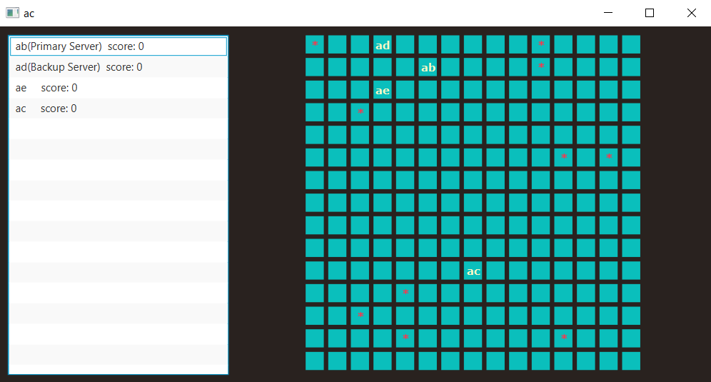

# MazeGame
a Peer-to-Peer Distributed Maze Game implemented by Java

## Game Description:
This is an Peer-to-Peer Distributed Maze Game implemented using Java. The maze consists N*N grid, with K treasures placed randomly at the grid. The player is to collect treasures in the maze. There is no actual server storing the game state but player Game program is acting as server. Among all the players, one player is chosen to be primary server and another player is backup server.
Some rules about the game are:
- It is designed as a distributed game. The number of player is arbitary.
- Each player can see other players scores from Game GUI.
- Game is fault-tolerant, it is robust against player crashes
- Game is played in distributed manner using Java RMI.
- Game is played by reading text lines from standard input

## Key components:
### Tracker
Tracker program is running with static/well-known IP address and port. Tracker program knowns value of N and K. When launched, Game contact the Tracker to obtain Game information, e.g. N and K.
feature:
	- Each game program contact only when it joins the game or some player crashed and is trying to regenerated game servers.
		
### Game Program
Game is main program for user to play with. It has GUI with maze grid.
feature:
- shows name of local player
- shows current score of all the player
- shows each player and treasure position in the maze
- shows primary server and backup server name

### Stress Test
Stress Test is a program to test the robustness of the Game. It will create many players (by invoking Game program), inject move requests to the players, kill players, and so on. It will create a new folder "StressTestOutput" and store all standard output/error of the game.
	

## File description:
- `Tracker.java` is the main java file for Tracker program.
- `Game.java` is the main java file for Game program.
- `StressTest.java` is the main java file for Stress Test program

## How to run:
### Prepaire:
put all java file under same folder

### compile:
- `javac Tracker.java`
- `javac StressTest.java`
- `javac Game.java`
for some later JDK(later than JDK 8), we need to give javafx module path in the command as:
	`javac --module-path "path\to\javafx sdk\lib" --add-modules javafx.controls,javafx.fxml Game.java`
	
### Run:
#### Tracker:
`java Tracker [port-number] [N] [K]` , here port-number, N and K are optional, default port is 1099, N is 15 and K is 10
#### Game:
`java Game [IP-address] [port-number] [player-id]`, here Ip-address and port is Tracker's IP address and port. player-id is two-character name of the player, like "aa"
for some later JDK(later than JDK 8), we need to give javafx module path in the command , example:
	`java --module-path "C:\Program Files\Java\javafx-sdk-11.0.2\lib" --add-modules javafx.controls,javafx.fxml Game 127.0.0.1 1099 ab`
##### standard input rules:
- "0": refresh page
- "1": move left
- "2": move down
- "3": move right
- "4": move up
- "9": exit
#### Stress Test:
`java StressTest 127.0.0.1 1099 "java --module-path \"C:\Program Files\Java\javafx-sdk-11.0.2\lib\" --add-modules javafx.controls,javafx.fxml Game"`
	
### Note: 
- Tracker should start first. Then Game program/Stress Test program can be lanuched.
